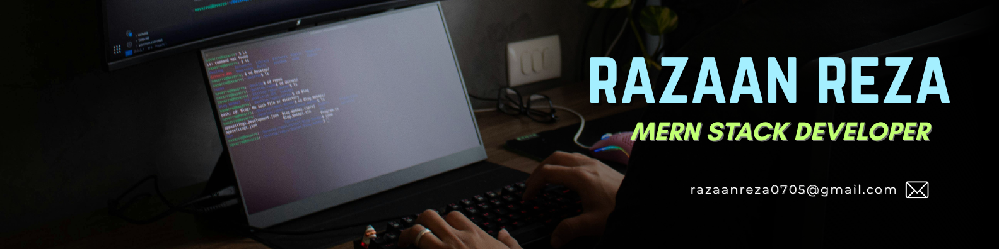

<h1 align="center">
  Hi,  I'm Razaan Reza
</h1>
<h3 align="center">MERN Stack Developer from Dhaka, Bangladesh</h3>

  📧 <strong>Email:</strong> <a href="mailto:razaanreza0705@gmail.com">razaanreza0705@gmail.com</a>

---

## 👨‍💻 About Me  
I’m Razaan — a passionate MERN Stack Developer with a strong interest in building scalable and user-friendly web applications.  
I completed my BSc in CSE from ULAB and I'm currently pursuing my M.Engg at BRAC University.

I have hands-on experience building full-stack projects using **MongoDB, Express, React, Node.js**, along with previous experience in **Laravel**.  
Even as a beginner, I have completed real-world projects and constantly improve my skills to keep up with modern trends.

---

## 🚀 Featured Projects

### 🛵 BookHive – A Book Courier App  
BookHive is a full-stack book courier application that allows users to browse, order, and review books from multiple librarians, with seamless delivery, role-based management, and secure payments.

**Tech Used:** React, Node.js, Express, MongoDB, Firebase, Tailwind

🔗 **Live Link:** https://sage-bubblegum-e870ed.netlify.app/

---

## 🛠️ Tech Stack

### **Frontend**

  
  
  
  
  
  

 

### **Backend**

  
  
  

### **Database**

  
  

 

### **Tools & Others**

  
  
  
  
  
  

 

---

## 🌱 Currently Learning  
- Advanced MERN Stack  
- API Security  
- Scalable backend structure  
- Clean code & architecture  

---

## 📫 Connect with Me  

  

---

## 📊 GitHub Stats  

---

## 💼 Open to Opportunities  
I am actively seeking **MERN Stack Intern / Junior Developer roles**.  
Feel free to reach out if you'd like to collaborate or hire me.

---
